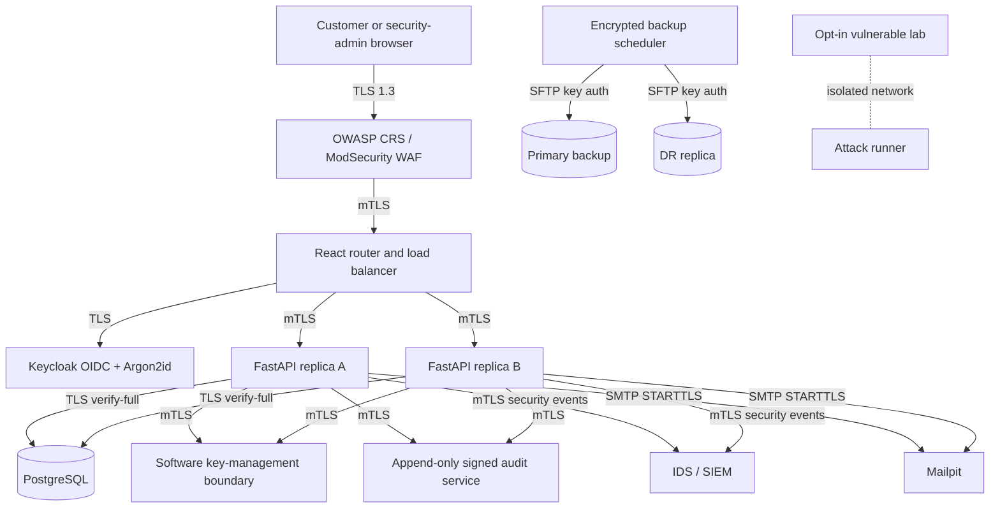

# Secure Bank Prototype

Secure Bank is a synthetic online-banking demonstrator built for the CW1 security architecture. It provides working controls at the algorithm, protocol, and system levels together with a separately isolated vulnerable lab for before/after attack evidence.

The project is intended for coursework demonstration only. It does not connect to payment rails, real email providers, cloud services, or live customer data.

## What is implemented

- React customer and security-administrator dashboards.
- Keycloak OpenID Connect Authorization Code + PKCE login, Argon2id password policy, RBAC, lockout controls, and ES384 tokens, followed by a clearly labelled browser-console OTP demonstration.
- FastAPI banking service with LKR minor units, row-locked ACID transfers, ownership checks, limits, recent password re-authentication, and idempotency.
- AES-256-GCM encrypted PII, descriptions, statements, and backups through a private key-management boundary.
- ECDSA P-384 signed receipts, backup manifests, and SHA-256 hash-chained audit records.
- TLS 1.3 through OWASP CRS, internal mTLS, PostgreSQL TLS, SMTP STARTTLS, and SFTP with Ed25519 keys.
- Segmented Compose networks, two API replicas, health-aware load balancing, WAF blocking, IDS/SIEM correlation, append-only audits, primary/DR backups, and a key-only bastion.
- Opt-in synthetic vulnerable application and automated secure-versus-vulnerable attack runner.

## Requirements

- Docker Desktop with Docker Compose v2.
- Windows 11 with WSL2, or macOS on Apple Silicon/Intel.
- At least 6 GB of memory available to Docker is recommended because the stack includes Keycloak, PostgreSQL, two API replicas, and security services.

No host installation of Python, Node.js, Java, PostgreSQL, or OpenSSL is required.

## Start the secure stack

The commands are identical in PowerShell and macOS Terminal:

```text
docker compose run --rm --build toolbox setup
docker compose up --build -d
docker compose ps
```

Open `https://localhost:8443`. The HTTP endpoint on `http://localhost:8080` exists only to demonstrate redirection to HTTPS.

Randomized demo passwords are written to `.local/demo-credentials.txt`. The available users are:

- `alice` - customer with account `100000000001`.
- `bob` - customer with account `100000000002`.
- `security-admin` - read-only security operations role.

After password login, the browser prints a short-lived demonstration OTP to its developer console and asks the user to copy it into the application. This client-side code is intentionally prototype-only and is not a production MFA control. Customer transfers still force a fresh Keycloak password login before commit.

### Trust the local CA

Export the generated CA without changing the host trust store:

```text
docker compose run --rm toolbox export-ca
```

This creates `.local/secure-bank-ca.crt`.

On Windows, import it into the current user's **Trusted Root Certification Authorities** using Certificate Manager. On macOS, import it into the login keychain with Keychain Access and set it to **Always Trust**. Trusting this CA is optional for CLI evidence because the toolbox verifies it directly, but browsers otherwise display a development-certificate warning.

## Evidence commands

Run unit and invariant tests:

```text
docker compose run --rm test-runner
```

Prove TLS 1.3, TLS 1.2 rejection, mTLS, PostgreSQL TLS, SMTP STARTTLS, and SFTP key-only authentication:

```text
docker compose run --rm toolbox protocol-check
```

The machine-readable result is written to `.local/protocol-check.json`.

Run the isolated vulnerable lab and identical attack comparisons:

```text
docker compose --profile lab run --rm attack-runner
```

The attack runner covers SQL injection, stored XSS, IDOR, token tampering, CSRF/replay, and brute force. It succeeds only when the secure target blocks the attempt and the synthetic vulnerable target exhibits the unsafe behavior.

Verify an encrypted backup by checking its ECDSA signature, SHA-256 digest, wrapped data key, AES-GCM tag, and a disposable PostgreSQL restore:

```text
docker compose --profile restore run --rm restore-check
```

## Cross-platform design

- All host-facing commands use `docker compose`; `setup.ps1` and `setup.sh` are optional conveniences.
- Certificate and credential generation happens in the multi-architecture toolbox container.
- Docker named volumes avoid host filesystem ownership differences.
- The project uses relative paths, UTF-8 text, and LF container scripts enforced by `.gitattributes`.
- No service depends on drive letters, `/bin/bash` on the host, `host.docker.internal`, or a host UID/GID.
- Selected base images support both `linux/amd64` and `linux/arm64`; no service forces x86 emulation on Apple Silicon.

## Architecture



The detailed marking/evidence map is in [SECURITY.md](SECURITY.md), and the presentation sequence is in [DEMO.md](DEMO.md).

## Operational commands

```text
docker compose logs -f waf api-a api-b keycloak
docker compose restart api-a api-b
docker compose down
```

To completely reset all synthetic data, keys, credentials, audit entries, and backups, run `docker compose down -v`, remove `.local`, and run setup again. This is destructive by design and should only be used for the coursework environment.

## Honest prototype boundaries

- Docker networks demonstrate segmentation and default-deny reachability but are not a physical NGFW.
- The private key service demonstrates the HSM interface and non-exported master keys but is not hardware-backed.
- IDS/SIEM rules correlate application and security events; the prototype does not mirror raw network packets.
- Primary and DR backups use separate restricted stores on one Docker host, not geographically separate facilities.
- Mailpit receives only synthetic local mail. SFTP stores only encrypted synthetic statements/backups.
